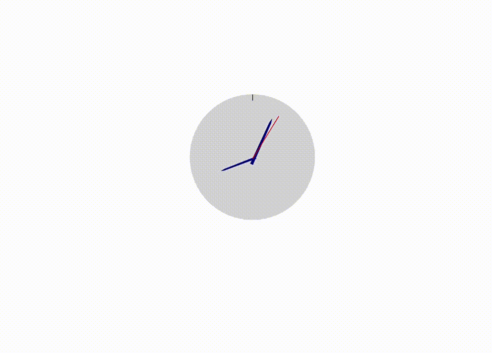

# Bài tập cuối kì môn Đồ họa máy tính 
- [Bài tập chương 2](https://github.com/lapali20/CG_Final_Project/blob/main/Incline_Exercises_Clock/Incline_Exercises_Clock/Incline_Exercises_Clock/MainWindow.xaml)   
- Ứng dụng:  
  - [Chong chóng](https://github.com/lapali20/CG_Final_Project/blob/main/Chong_chong/Chong_chong/Chong_chong/MainWindow.xaml)  
  - [Running man](https://github.com/lapali20/CG_Final_Project/blob/main/Running_man/Running_man/Running_man/MainWindow.xaml)  
  
 

